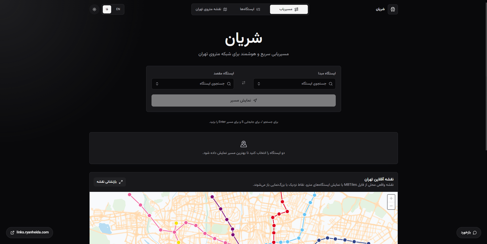
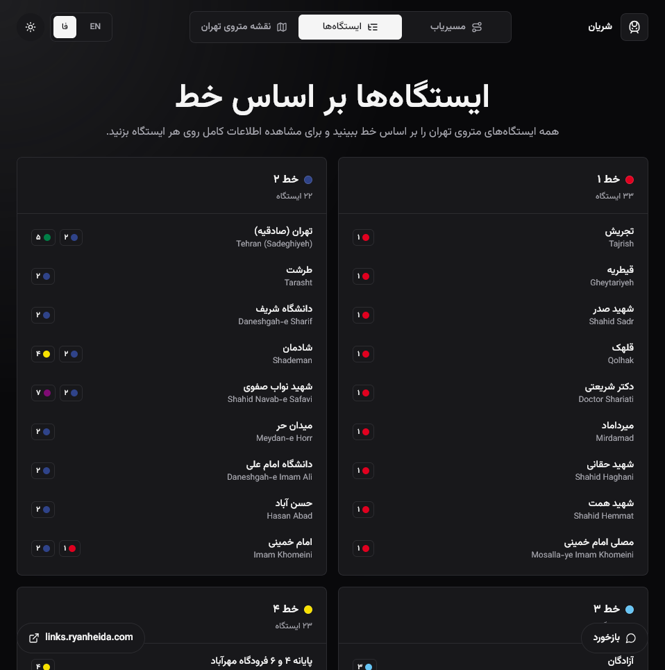
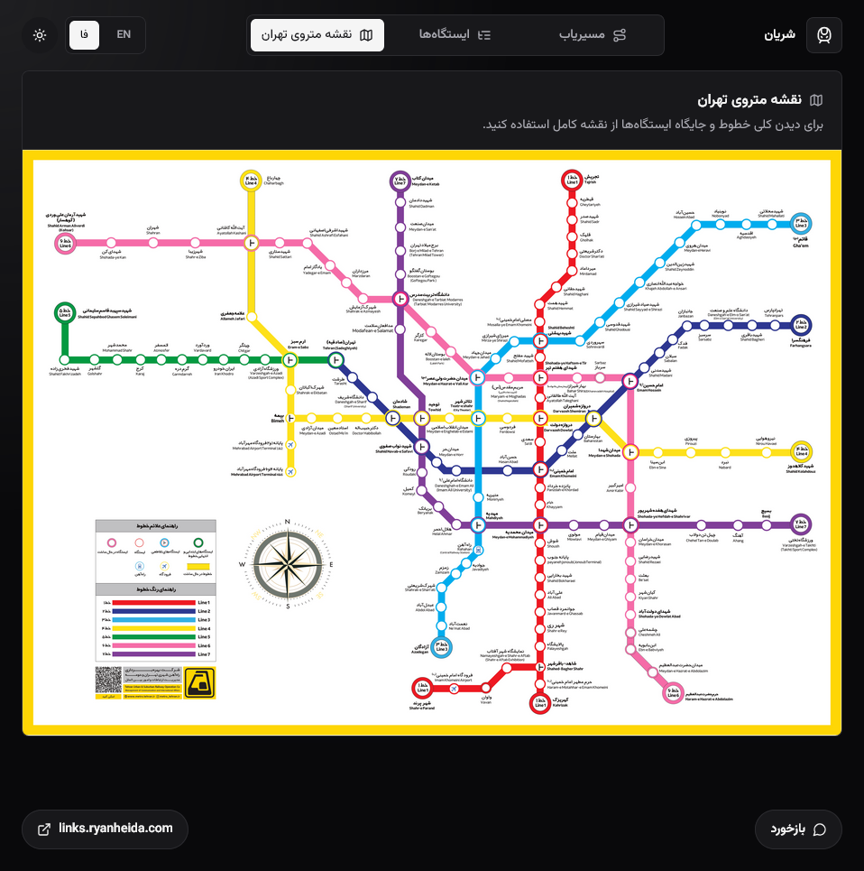

# Sharyaan

A modern offline-first route planner for the Tehran Metro network.

Sharyaan helps riders find fast routes across Tehran Metro with a modern navigation experience. The app uses `src/data/stations.json` as the single source of truth for stations, coordinates, line colors, and relations.

## Website Link

> [sharyaan.ryanheida.com](https://sharyaan.ryanheida.com)

## Demo

<table width="700">
  <tr>
    <td colspan="2">
      
    </td>
  </tr>
  <tr>
    <td width="50%">
      
    </td>
    <td width="50%">
      
    </td>
  </tr>
</table>

## Features

- Next.js App Router frontend with static station and line detail pages
- Bilingual English/Persian UI with RTL support and Persian numerals
- Light and dark themes with local persistence
- Searchable station comboboxes with keyboard navigation
- Bidirectional graph builder and Dijkstra shortest path routing
- Transfer-aware route summary and animated station timeline
- Local MapLibre street map using extracted MBTiles vector tiles
- Station directory, station detail pages, line detail pages, and official map image
- Recent searches, favorite stations, shareable route URLs, and copy route action
- Feedback form backed by `POST /api/feedback`

## Setup

```bash
npm install
npm run maps:extract
npm run dev
```

Then open the Next.js URL shown in the terminal, usually `http://localhost:3000`.

Clean routes such as `/stations/tajrish`, `/stations/qeytarieh`, `/stations/shahid-sadr`, and `/lines/1` are handled by Next.js App Router.

## Offline Map Tiles

The real Tehran street map is stored as MBTiles in `assets/maps/`. Browsers cannot read MBTiles directly, so the app needs extracted local vector tiles before running or building with the offline street map enabled.

Run this after cloning the repo, after changing the MBTiles file, and before deployment builds:

```bash
npm run maps:extract
```

This generates `public/maps/tehran/` from the MBTiles file. That generated folder is intentionally ignored by git because it can be recreated.

## Build

```bash
npm install
npm run maps:extract
npm run build
npm run start
```

Set `NEXT_PUBLIC_SITE_URL` for canonical URLs, sitemap output, and robots metadata:

```bash
NEXT_PUBLIC_SITE_URL=https://example.com npm run build
```

`SITE_URL` and the legacy `VITE_SITE_URL` are also accepted as fallbacks by `src/services/seo.ts`.

## SEO Output

Next.js now owns SEO generation:

- `app/layout.tsx` and route files export metadata
- `app/stations/[slug]/page.tsx` statically generates station pages from `src/data/stations.json`
- `app/lines/[lineId]/page.tsx` statically generates line pages
- `app/sitemap.ts` generates `/sitemap.xml`
- `app/robots.ts` generates `/robots.txt`

The old Vite SEO generator and `dist/` HTML fallback flow have been removed.

## Scripts

```bash
npm run dev
npm run build
npm run start
npm run lint
npm run maps:extract
npm run smoke:route
```

## Project Structure

```text
app/
  layout.tsx
  page.tsx
  metro-map/page.tsx
  stations/page.tsx
  stations/[slug]/page.tsx
  lines/[lineId]/page.tsx
  robots.ts
  sitemap.ts
src/
  components/
  data/
  hooks/
  i18n/
  services/
  store/
  types/
  utils/
  views/
functions/
  api/feedback.ts
public/
  maps/tehran/       # generated by npm run maps:extract
```

## Data Notes

Station JSON is the single source of truth. Mojibake strings are repaired at runtime.

Graph connections are bidirectional unless otherwise specified.

## Feedback And Telemetry

This project keeps the existing Cloudflare Pages Function for feedback submissions:

```text
Next frontend
  -> POST /api/feedback
  -> functions/api/feedback.ts
  -> Cloudflare D1 binding DB
```

The frontend payload uses `route_from` and `route_to`, matching the Cloudflare function and D1 schema.

### Request Body

```json
{
  "type": "bug | feature | data | other",
  "message": "User feedback message",
  "email": "optional email",
  "station": "optional station name",
  "route_from": "optional origin station",
  "route_to": "optional destination station",
  "timestamp": "ISO 8601 string"
}
```

### D1 Database Schema

```sql
CREATE TABLE feedback (
  id INTEGER PRIMARY KEY AUTOINCREMENT,
  type TEXT,
  message TEXT NOT NULL,
  email TEXT,
  station TEXT,
  route_from TEXT,
  route_to TEXT,
  created_at TEXT
);
```

### Cloudflare Notes

Bind a D1 database named `DB` to the Pages project or equivalent Cloudflare runtime.

If deploying the Next app on Cloudflare, use a Next-compatible Cloudflare deployment path and preserve `/api/feedback` routing to `functions/api/feedback.ts`, or migrate that function to the chosen Next/Cloudflare adapter explicitly.
